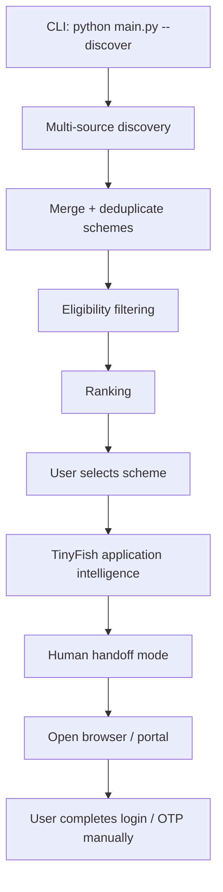
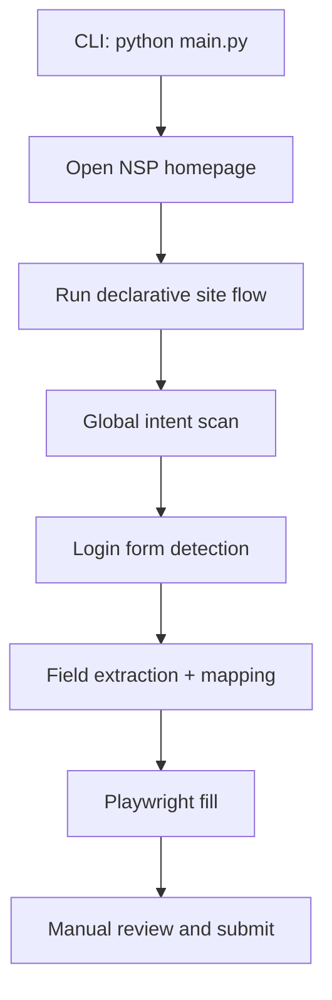

# AutoApply AI Repository Architecture Report

Date: 2026-03-28  
Project: Tinywish Hackathon  
Authoring basis: current repository analysis + reference extraction from `C:\Users\athar\Downloads\AutoApply_AI_Architecture_locked.docx`

## 1. Executive Summary

This repository is an autonomous scholarship-assistance system with two major operating modes:

1. Discovery mode  
   It collects scholarship schemes from multiple sources, filters them against a student profile, ranks them, and lets the user select a target scheme.

2. Application assistance mode  
   It uses TinyFish as an application-intelligence agent to discover the safest and most reliable application path, then hands execution to the user at the authentication boundary.

The current codebase is no longer a pure “full automation” architecture. It has evolved into a hybrid system:

- Playwright handles deterministic browser automation where the UI is known.
- TinyFish handles reasoning, application intelligence, ranking assistance, and workflow reconstruction.
- The final application stage is now human-in-the-loop by design.

This is the right direction for demo reliability because government portals with login, OTP, CAPTCHA, and dynamic UI are poor candidates for end-to-end unattended automation.

## 2. Reference Context From the Older Architecture Report

The old locked architecture report described a six-phase system with these main assumptions:

- TinyFish-first discovery on NSP
- Playwright fallback for discovery
- Eligibility and ranking as separate phases
- Full application automation including login and OTP handling
- NSP as the primary target

That report is still useful historically, but the current repository has diverged in several important ways:

- Discovery is now multi-source, not just NSP.
- TinyFish discovery is currently disabled in code.
- The application stage is now a preparation and handoff system, not a full submission bot.
- Private scholarship sources have been added to discovery.
- Ranking now mixes heuristic scoring and TinyFish-assisted ranking.

## 3. Current Top-Level Architecture

The repository is organized into these main parts:

- `main.py`
  CLI entry point. Dispatches discovery vs apply flows.

- `core/`
  Higher-level product logic:
  - `core/discovery/` for scrapers, eligibility, ranking
  - `core/application_agent.py` for TinyFish-powered application intelligence and human handoff
  - `core/integrations/tinyfish_client.py` for TinyFish client construction
  - `core/intent_filter.py` for click safety mode switching

- `executor/`
  Playwright action orchestration:
  - browser startup
  - fuzzy clicking
  - flow execution
  - login form handling
  - intent-based navigation shortcuts

- `extractor/`
  DOM and field extraction utilities.

- `mapper/`
  Maps extracted form fields to profile values.

- `schemas/`
  Pydantic profile schema.

- `sites/`
  Site-specific flow configuration, currently NSP-centric.

- `utils/`
  Logging, helpers, retry utility.

## 4. Current End-to-End System Diagram

There is also a legacy Playwright apply flow:

## 5. Workflow 1: Discovery Mode

Entry point: `run_discovery()` in `main.py`

### 5.1 Sequence

1. Load profile from `profile.json`
2. Call all configured scrapers
3. Merge and deduplicate schemes
4. Run eligibility filtering
5. Run ranking
6. Print ranked schemes
7. User selects one scheme
8. Hand off to application intelligence

### 5.2 Current source set

Government-oriented:

- `scrape_nsp()`
- `scrape_myscheme()`

Private-oriented:

- `scrape_buddy4study()`
- `scrape_we_make_scholars()`
- `scrape_scholarships360()`
- `scrape_international_scholarships()`

### 5.3 Output contract

Merged scheme objects are currently normalized into a superset shape that can include:

- `name`
- `state`
- `category`
- `income_limit`
- `course_level`
- `source`
- `source_type`
- `provider`
- `eligibility`
- `apply_link`
- `type`

This is useful because discovery, eligibility, ranking, and application intelligence all need slightly different views of the same scheme.

## 6. Workflow 2: NSP Discovery Pipeline

Main module: `core/discovery/nsp_scraper.py`

### 6.1 Intended architecture

The module still documents a 3-tier NSP strategy:

1. Cache
2. TinyFish
3. Playwright

### 6.2 Actual current behavior

Actual current behavior is:

1. Cache if available
2. TinyFish path is disabled
3. Playwright fallback performs the real extraction

The key implementation facts:

- `try_tinyfish()` returns `None`
- `_try_tinyfish()` returns `None`
- `_navigate_to_schemes(page)` goes directly to `/All-Scholarships`
- `_extract_schemes_accordion(page)` uses dropdown + accordion extraction
- final results are deduplicated and cached

### 6.3 Why this changed

The old plan depended on TinyFish as the primary NSP scraper. In practice, SDK surface instability and portal variability made that unreliable. The code was therefore stabilized around deterministic Playwright extraction.

### 6.4 Current extractor strategy

The Playwright extractor:

- opens `https://scholarships.gov.in/All-Scholarships`
- iterates dropdown options
- clicks search in the correct form
- expands accordion sections
- extracts names from expanded content
- splits entries using markers like:
  - `Scheme Open from`
  - `Specifications`

This solves the earlier bug where multiple schemes were concatenated into one result.

## 7. Workflow 3: Multi-Source Merge and Deduplication

Main module: `core/discovery/multi_source.py`

### 7.1 Source normalization

Government sources are normalized with:

- `name`
- `state`
- `category`
- `income_limit`
- `course_level`
- `source`
- `source_type = government`

Private sources are normalized with:

- `name`
- `provider`
- `eligibility`
- `apply_link`
- `type = private`
- `source`
- `source_type = private`

### 7.2 Duplicate removal

Duplicates are resolved using `SequenceMatcher` similarity on scheme names.

Current threshold:

- duplicate if name similarity is `>= 0.85`

When duplicates are found:

- the more detailed record is kept
- missing fields are merged in from the less detailed record

### 7.3 Important tradeoff

This merge logic is practical and demo-friendly, but not semantically perfect. Similar names do not always mean identical scholarships. The current approach is acceptable for prototype deduplication, not for production-grade entity resolution.

## 8. Workflow 4: Eligibility Filtering

Main module: `core/discovery/eligibility.py`

### 8.1 Current approach

The system no longer depends on structured eligibility metadata from every source. Instead, it uses scheme-name heuristics.

It checks:

- category keywords
- state relevance
- course-level keywords
- merit/open/income-based hints

### 8.2 Current matching logic

Schemes are included when:

- category matches, or
- state matches

Current scoring:

- `+2` category
- `+2` state
- `+1` course

### 8.3 General-category realism improvement

The filter now excludes restricted schemes for general-category users when names imply:

- `only for obc`
- `obc only`
- `only for sc`
- `only for st`

For general users, it prefers:

- merit-based
- open category
- income-based

This is a necessary realism improvement because a pure keyword match would otherwise over-include category-locked schemes.

## 9. Workflow 5: Ranking

Main module: `core/discovery/ranking.py`

### 9.1 Current architecture

Ranking has two layers:

1. TinyFish-assisted ranking
2. Rule-based fallback ranking

### 9.2 TinyFish ranking

The current implementation:

- takes top 20 eligible schemes
- sends them with the profile to TinyFish
- asks for a priority-based ranking
- parses `name`, `reason`, `priority`

### 9.3 Fallback ranking

If TinyFish fails, fallback ranking sorts by:

- `match_score`
- name as tiebreaker

Additional private-source bonus:

- `+1` if `source_type == private` and `apply_link` exists

### 9.4 Why this design works

This is a good hybrid design:

- deterministic enough for fallback
- explainable
- can incorporate richer reasoning when TinyFish works

## 10. Workflow 6: Application Intelligence and Human Handoff

Main module: `core/application_agent.py`

### 10.1 Current product decision

The system does not try to fully automate login/OTP.

Instead it:

1. Uses TinyFish to understand the application path
2. Extracts:
   - `apply_link`
   - `fields`
   - `documents`
   - `steps`
   - `form_detected`
3. Opens the portal locally if possible
4. Prints an auto-fill guide from the student profile
5. Hands execution to the user for login/OTP/authentication

### 10.2 Current output modes

The handoff layer labels output as:

- `Auto-Fill Ready Mode`
- `Pre-Application Intelligence Mode`

That is a good demo decision because it makes the system behavior explicit instead of pretending every target site is equally automatable.

### 10.3 Human handoff behavior

`handle_human_handoff(result, profile)`:

- opens the browser with `webbrowser.open(...)` if `apply_link` exists
- prints the profile as an auto-fill guide
- prints required documents
- prints application steps
- prints a note that login/OTP must be completed manually

This is the cleanest boundary in the current repo.

## 11. Workflow 7: Legacy Playwright Apply Flow

Main modules:

- `main.py`
- `executor/flow_engine.py`
- `executor/form_handler.py`
- `executor/actions.py`
- `extractor/field_extractor.py`
- `mapper/field_mapper.py`
- `sites/nsp.py`

### 11.1 Flow shape

The legacy apply path still exists and is capable of:

- opening NSP
- following a declarative step list
- intent-scanning for direct actions
- detecting login forms
- filling safe fields
- pausing for OTP and CAPTCHA
- extracting and filling remaining form fields

### 11.2 Why it still matters

This path is the deeper engineering foundation of the repo. Even though the new product direction prefers human handoff for authentication-heavy stages, the legacy flow proves:

- browser automation capability
- step-driven orchestration
- form extraction
- field mapping
- HITL pause design

It is still valuable from an architecture and learning perspective.

## 12. Module Responsibilities

### `main.py`

- CLI mode switching
- discovery orchestration
- legacy apply flow entry

### `core/discovery/nsp_scraper.py`

- cache handling
- NSP Playwright scraping
- legacy TinyFish parser helpers

### `core/discovery/multi_source.py`

- all source scrapers
- source normalization
- merge and dedup

### `core/discovery/eligibility.py`

- heuristic eligibility filtering
- category/state/course scoring

### `core/discovery/ranking.py`

- TinyFish ranking prompt and parser
- fallback ranking

### `core/application_agent.py`

- TinyFish SSE request handling
- application intelligence extraction
- human handoff mode

### `executor/actions.py`

- fuzzy text lookup
- section-aware clicking
- click safety
- click history

### `executor/flow_engine.py`

- declarative execution of step sequences
- intent short-circuiting
- login and fill integration

### `executor/form_handler.py`

- login page detection
- safe field classification
- phase-1 CTA
- OTP HITL
- phase-2 CTA
- CAPTCHA HITL

### `extractor/field_extractor.py`

- raw field extraction
- selector generation

### `mapper/field_mapper.py`

- map normalized profile values to extracted fields

### `sites/nsp.py`

- declarative site flow

## 13. What Has Been Built So Far

From the current repo state, the following are genuinely implemented:

### Core implementation already done

- CLI entrypoint with discovery vs apply paths
- multi-source scheme discovery
- NSP Playwright scraper with dropdown + accordion logic
- scheme merge and duplicate removal
- heuristic eligibility filtering
- hybrid ranking engine
- TinyFish application-intelligence agent
- human-handoff mode
- legacy Playwright-driven apply automation flow
- login / OTP / CAPTCHA HITL handling
- field extraction and mapping utilities
- centralized logging

### Product direction already established

- not bypassing authentication
- preparation mode when forms are not directly visible
- application-ready mode when a form is detected
- mix of government and private scholarship sources

## 14. Main Problems Faced and How the Project Is Handling Them

### 14.1 TinyFish SDK/API instability

Problem:

- method surface changed over time
- discovery integration was unreliable
- response shapes were inconsistent

Current handling:

- TinyFish discovery is disabled in `nsp_scraper.py`
- TinyFish is still used for ranking and application intelligence
- response parsing supports dict/string/object variants
- SSE handling uses `event_name` to capture `completed` or `result`

### 14.2 NSP portal UI instability

Problem:

- table-based assumptions became invalid
- current page uses filter + accordion patterns
- content is dynamic after expansion

Current handling:

- direct URL navigation to `/All-Scholarships`
- dropdown iteration
- accordion extraction
- boundary-based text splitting

### 14.3 Eligibility metadata sparsity

Problem:

- many sources do not provide structured eligibility
- NSP extraction often has only name-level detail

Current handling:

- name-based heuristics
- category/state/course matching
- merit/open/income interpretation for general users

### 14.4 Government login/OTP complexity

Problem:

- OTP/CAPTCHA/auth flows are unstable and risky to automate end-to-end

Current handling:

- human handoff
- browser opens locally
- system provides fields, documents, and workflow
- no authentication bypass

### 14.5 Multi-source duplicate noise

Problem:

- same scholarship may appear across many sources with slightly different names

Current handling:

- `SequenceMatcher` threshold-based dedup
- “keep the most detailed record” merge rule

## 15. Bugs and Risks Found During This Repo Analysis

These are the highest-signal findings from the current codebase.

### Bug 1: `mapper/form_mapper.py` maps Aadhaar incorrectly

File:

- `mapper/form_mapper.py`

Issue:

- when a field label contains `aadhaar`, it returns `config.AADHAAR_PATH`
- that is a file path, not an Aadhaar number

Impact:

- a text Aadhaar field may be filled with a PDF path instead of the ID number

### Bug 2: `mapper/form_mapper.py` uses `income`, but profile uses `annual_income`

Files:

- `mapper/form_mapper.py`
- `profile.json`

Issue:

- mapper reads `profile.get("income")`
- profile stores `annual_income`

Impact:

- income fields in the legacy apply flow may not be filled

### Bug 3: schema and runtime profile structure are inconsistent

Files:

- `schemas/profile_schema.py`
- `profile.json`

Issue:

- schema expects `income`
- discovery and profile use `annual_income`
- current `profile.json` email placeholder is not a valid email address for Pydantic validation

Impact:

- full validation can fail or diverge from runtime behavior

### Bug 4: requirements are incomplete

Files:

- `requirements.txt`
- `core/integrations/tinyfish_client.py`
- `schemas/profile_schema.py`

Issue:

- repo imports `tinyfish`
- repo imports `pydantic`
- neither package is listed in `requirements.txt`

Impact:

- fresh setup is likely to break

### Bug 5: TinyFish discovery comments are outdated

File:

- `core/discovery/nsp_scraper.py`

Issue:

- comments say TinyFish-first
- actual implementation has `try_tinyfish()` disabled

Impact:

- architecture comments do not reflect runtime behavior
- future contributors can make wrong assumptions

### Risk 6: `main.py` hard-fails if `TINYFISH_API_KEY` is missing

File:

- `main.py`

Issue:

- the script raises immediately if the env key is absent

Impact:

- this blocks modes that could otherwise partially function
- not ideal for repo portability or offline analysis

### Risk 7: private-source scrapers are heuristic

File:

- `core/discovery/multi_source.py`

Issue:

- private-source extraction is regex/HTML based
- not selector-aware or API-backed

Impact:

- source quality may drift as sites change markup

## 16. Recommended Next Engineering Steps

### High priority

1. Fix profile/schema consistency
   - standardize on `annual_income` or `income`
   - standardize profile contract across discovery and apply flows

2. Fix form mapper defects
   - Aadhaar text fields should map to Aadhaar number, not PDF path
   - document uploads should be handled as upload fields only

3. Add missing dependencies to `requirements.txt`
   - `tinyfish`
   - `pydantic`

4. Rewrite stale architecture comments
   - especially in `nsp_scraper.py`

### Medium priority

5. Separate government and private ranking strategies more clearly
6. Add unit tests for:
   - dedup
   - eligibility scoring
   - ranking fallback
   - application-result parsing

7. Add a unified scheme model
   - today the repo uses a flexible dict superset
   - a formal schema would reduce drift

### Lower priority

8. Add persistence for selected scheme and application session
9. Add lightweight reporting/export for discovery results
10. Improve private scrapers using source-specific selectors

## 17. Recommended Final System Framing

The cleanest way to present this project now is:

1. Multi-source scholarship discovery
2. Eligibility filtering
3. Ranking
4. TinyFish-powered application intelligence
5. Human-execution handoff for authentication-heavy stages

That framing is technically honest and strong for demos because:

- AI handles complexity and reasoning
- deterministic automation handles extraction where it is safe
- the user retains control over login, OTP, and final submission

## 18. Study Roadmap for a First-Year Student

This section is the “what to study next” map for understanding this repo from fundamentals to architecture.

### 1. Python basics

Study:

- functions
- dictionaries
- lists
- loops
- exceptions
- imports and modules

Why:

- almost every file in this repo is built from these basics

### 2. CLI applications with `argparse`

Study:

- command-line arguments
- flags like `--discover`

Why:

- `main.py` is a CLI controller

### 3. JSON and configuration management

Study:

- reading JSON files
- environment variables
- `.env`

Why:

- profile loading, API keys, and data exchange all rely on this

### 4. Logging

Study:

- Python `logging`
- log levels
- structured debugging

Why:

- this repo depends heavily on logs to explain browser and agent behavior

### 5. Browser automation with Playwright

Study:

- selectors
- pages, locators, clicks
- waiting for network idle
- form interaction

Why:

- the apply engine and NSP scraper depend on Playwright

### 6. DOM and HTML structure

Study:

- inputs
- selects
- textareas
- accordion UI
- labels and placeholders

Why:

- field extraction and scraping depend on DOM understanding

### 7. Web scraping fundamentals

Study:

- HTTP requests
- HTML parsing
- extracting titles and links
- fragility of markup-based scraping

Why:

- multi-source discovery uses lightweight public-page scraping

### 8. Data normalization

Study:

- converting many source formats into one schema
- cleaning text
- handling missing values

Why:

- this is a major part of discovery and merge design

### 9. Deduplication and similarity matching

Study:

- exact-match dedup
- fuzzy similarity
- `SequenceMatcher`

Why:

- the merged discovery pipeline depends on this

### 10. Rule-based filtering and scoring

Study:

- heuristic matching
- keyword rules
- score accumulation

Why:

- eligibility and ranking fallback are rule-based systems

### 11. Pydantic and schemas

Study:

- data validation
- schema consistency
- model vs dict workflows

Why:

- the repo already uses Pydantic and would benefit from using it more consistently

### 12. State machines and flow engines

Study:

- steps
- transitions
- orchestration
- short-circuit logic

Why:

- `executor/flow_engine.py` is basically a small flow engine

### 13. Human-in-the-loop system design

Study:

- where automation should stop
- safety boundaries
- manual checkpoints

Why:

- this is one of the most important architectural ideas in the repo

### 14. API integration and SSE

Study:

- HTTP POST requests
- streaming responses
- server-sent events
- JSON parsing

Why:

- TinyFish application intelligence depends on SSE parsing

### 15. Software architecture and pipeline thinking

Study:

- layers
- responsibilities
- module boundaries
- data contracts
- fallback systems

Why:

- this repo is best understood as a set of connected pipelines, not isolated scripts

## 19. Final Assessment

This repository is no longer just a browser automation script. It is now a multi-stage AI-assisted workflow system with:

- discovery
- normalization
- filtering
- ranking
- application intelligence
- human handoff

Its strongest current idea is not “full autonomous submission.”  
Its strongest idea is “AI-assisted scholarship preparation with controlled automation and explicit human takeover at authentication boundaries.”

That is both more robust technically and easier to defend in a live demo.
